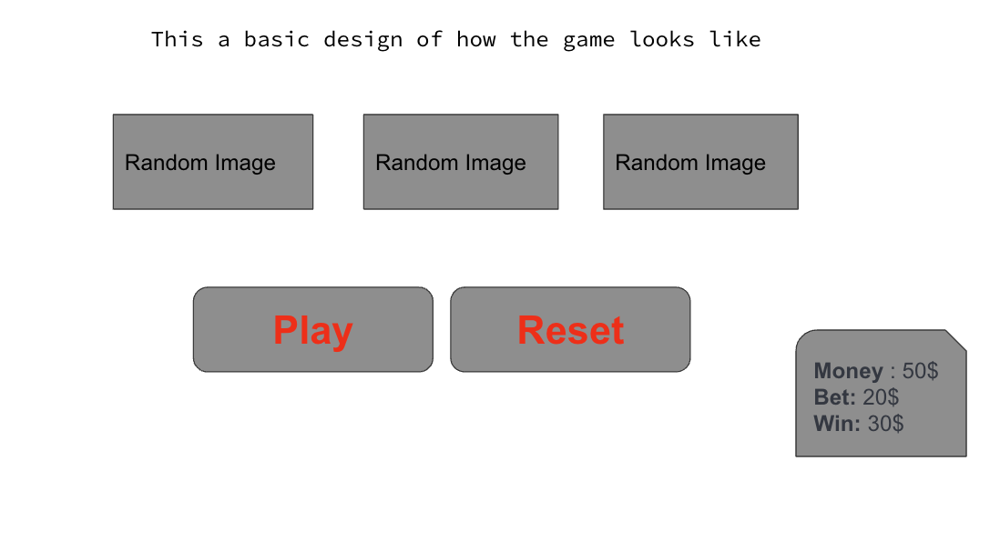
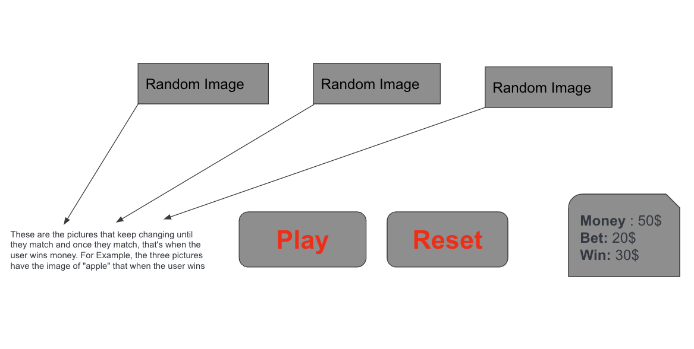
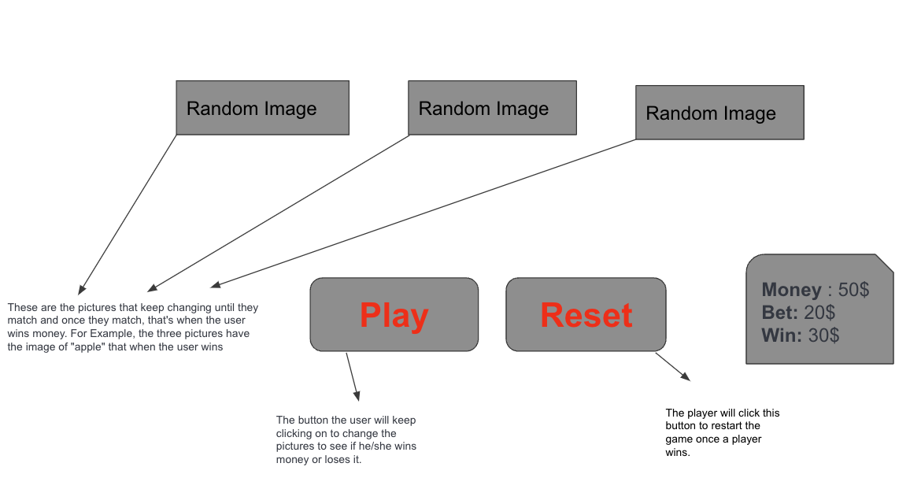
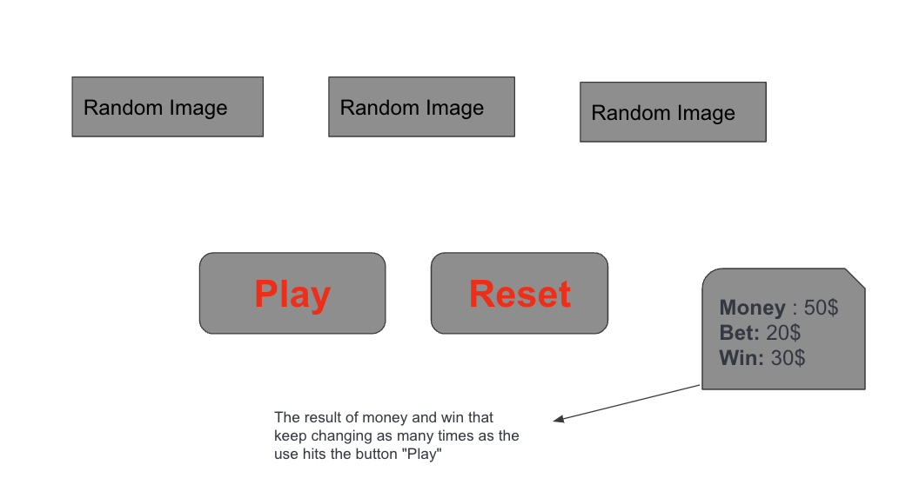
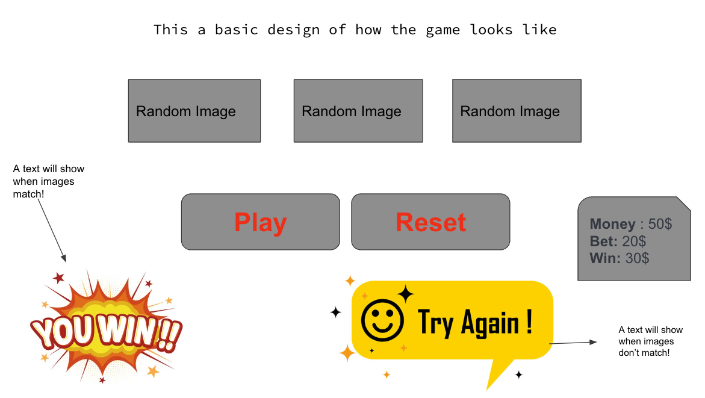

# Project Overview:

Slot Machine Game is a game that gives three different possibilites of images that 
are generated randomly. The player adds some amount of money as a bet and is expected to win every time these images match and show the exact image. Everytime the player get a result of unmatching images, player is expected to lose money.

## Technologies Used

- HTML
- CSS
- JavaScript

## User Stories

As a user, I want to be able to:
* Have the play button to click in order to see chances of winning.
* Have a reset button to click everytime I want to play more.
* To see how much money I lose and how much money I win.
* Expect to see a message telling "You Won!" and "You Lost!"

## Wireframes

